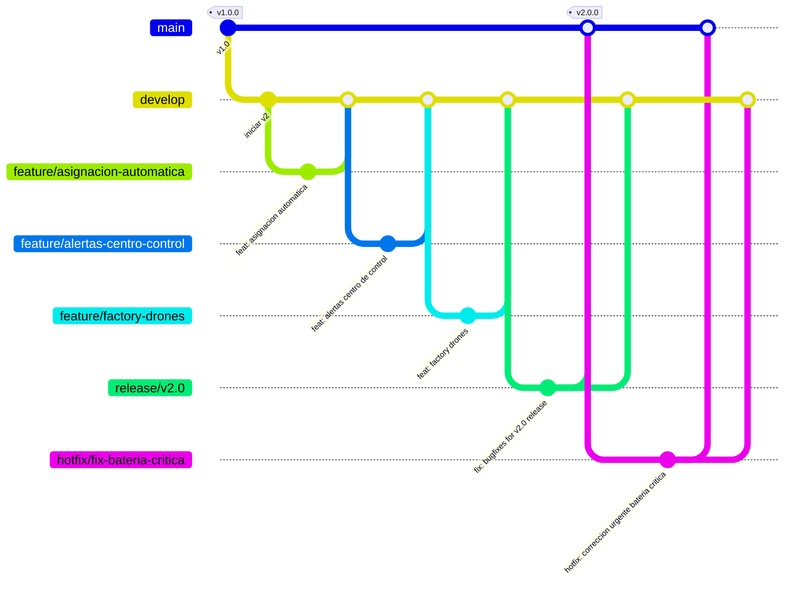

# AquaPort

Sistema integral de gestión y monitoreo de la flota de drones acuáticos.

## Diagrama de Ramas (GitFlow)

AquaPort utiliza GitFlow para organizar el ciclo de vida del desarrollo. A continuación se documenta el flujo utilizado para la versión v2:

