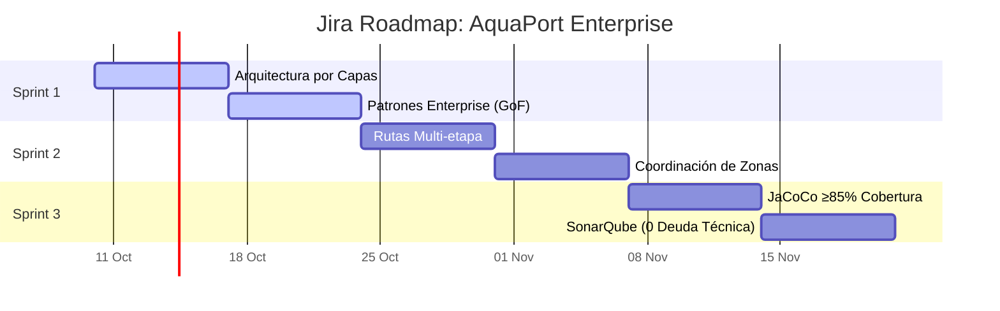

# Roadmap & Agilismo (AquaPort Enterprise)

En esta etapa de madurez, hemos planificado las épicas y sprints en Jira utilizando métricas ágiles claras y objetivos concretos.

## 1. Roadmap Enterprise (3 Sprints)

A continuación, la representación del Roadmap extraído de Jira, enfocado en llevar AquaPort a su madurez técnica y operativa (Nivel Empoleon).

### Detalle de Sprints

| Sprint | Sprint Goal | Capacidad del Equipo | Definition of Done (DoD) Enterprise |
|--------|-------------|----------------------|---------------------------------------|
| **Sprint 1** | Refactorizar el núcleo a Clean Architecture e inyectar Patrones de Diseño. | 45 Puntos de Historia (Velocity) | Código sin imports externos en el dominio. Patrones Chain of Responsibility, Decorator y Adapter implementados. Revisión de PR aprobada por Lead. |
| **Sprint 2** | Habilitar operaciones de larga distancia con reasignación y waypoints. | 40 Puntos de Historia | Múltiples tramos probados con Mockito. El dron debe soltar carga en buzón y otro debe recogerla. Tiempo de respuesta de reasignación < 200ms. |
| **Sprint 3** | Blindar el software para producción (Zero-Bug Policy). | 35 Puntos de Historia | Quality Gate en verde (SonarQube). Cero vulnerabilidades. Reporte JaCoCo mostrando ≥85% line coverage. End-to-End Tests automatizados. |

---

## 2. Retrospectiva Real (Sprint v2 - Prinplup)

Revisión ágil del último ciclo finalizado, donde escalamos a la v2 introduciendo TDD, Streams, Mockito y Quality Gates.

### 🟢 ¿Qué funcionó bien? (Mad)
- **TDD y Mockito:** Empezar a escribir el test del `AsignadorAutomatico` antes que el código de negocio nos ahorró horas de debugging. Aislar dependencias con `@Mock` fue un éxito total.
- **GitFlow:** El uso de Conventional Commits (`feat:`, `fix:`) y las ramas protegidas ordenó el repositorio. El CHANGELOG autogenerado le encantó al Product Owner.

### 🔴 ¿Qué no funcionó? (Sad)
- **Cuellos de Botella en JaCoCo:** Subestimamos el tiempo que tomaría alcanzar el 80% de cobertura en las ramas amarillas (condicionales lógicos). 
- **Deuda Técnica Acumulada:** Se filtraron `System.out.println` al código en vez de usar Loggers, rompiendo el estándar de calidad en el primer escaneo de SonarQube.

### 🔵 ¿Qué cambiaremos? (Glad / Action Items)
- **Action Item 1:** Implementar *Pair Programming* obligatorio cuando se diseñen condicionales complejos (como los validadores encadenados) para asegurar cobertura de ramas desde el inicio.
- **Action Item 2:** Integrar el Quality Gate de SonarQube en el hook de `pre-push` de Git local. Así evitaremos que el código con *Code Smells* siquiera llegue al servidor.
