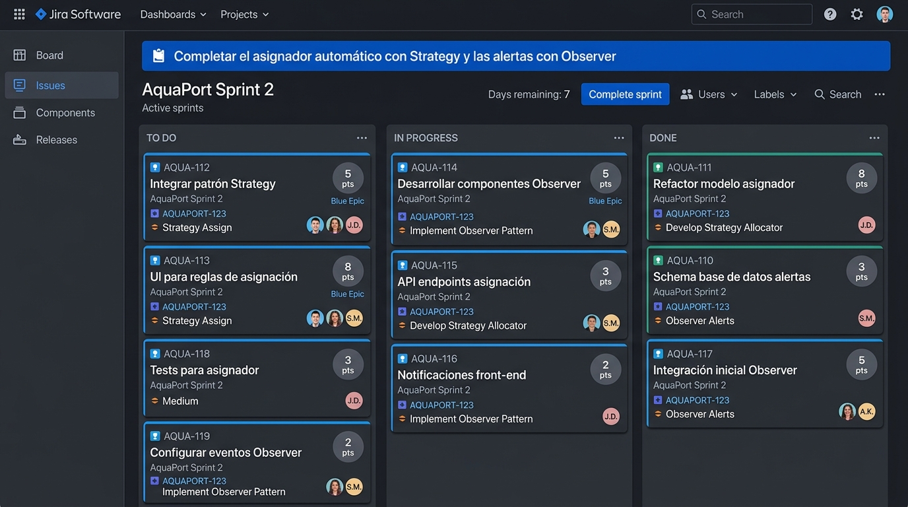

# Planificación Sprint 2 - AquaPort v2

## 🎯 Sprint Goal
> "Completar el asignador automático con Strategy y las alertas con Observer"

## 🛡️ Definition of Done (DoD) - AquaPort v2
Para que una Historia de Usuario se considere TERMINADA en este sprint, debe cumplir rígidamente con:
1. El código compila sin warnings.
2. Las pruebas unitarias pasan en su totalidad (JUnit 5).
3. JaCoCo reporta ≥80% de line coverage para la feature.
4. El PR tiene revisión aprobada por al menos otro miembro del equipo.
5. El diagrama C4 y la plantilla DOSW están actualizados en la documentación oficial.

---

## 📚 Sprint Backlog (User Stories & Puntos)

| Clave | Historia de Usuario (HU) | Story Points (Fibonacci) | Estado |
| :--- | :--- | :---: | :--- |
| **AQUA-20** | **[HU] Jerarquía Base (Factory)**: Como desarrollador, quiero refactorizar `DroneAcuatico` a una clase abstracta y crear el Factory Method para instanciar los 3 nuevos tipos, para soportar la diversidad de la flota. | **3** | DONE |
| **AQUA-21** | **[HU] Algoritmos de Asignación (Strategy)**: Como operador, quiero que el sistema elija inteligentemente el drone evaluando la zona y la batería, para no tener que decidirlo manualmente. | **5** | DONE |
| **AQUA-22** | **[HU] Motor de Alertas (Observer)**: Como técnico, quiero recibir una notificación en tiempo real cuando un drone falla en misión, para proceder a recuperarlo. | **5** | DONE |
| **AQUA-23** | **[HU] Prioridad Crítica (Strategy dinámico)**: Como solicitante de emergencias, quiero que mis paquetes críticos ignoren la regla de batería y exijan el drone más apto, para garantizar el éxito de mi misión. | **3** | DONE |
| **AQUA-24** | **[HU] UI Dashboard Flota**: Como operador hídrico, quiero visualizar los 15 drones agrupados en 3 columnas por tipo de vehículo, para reducir la carga cognitiva (Ley Hick). | **8** | DONE |
| **AQUA-25** | **[HU] API Condiciones Hídricas**: Como sistema, necesito consultar una API externa para bloquear misiones en zonas con mal clima, para no perder drones valiosos. | **5** | TO DO |
| **AQUA-26** | **[HU] Autorización Centro Control**: Como sistema, necesito emitir un request al centro de control antes del despegue, para cumplir normas universitarias. | **2** | TO DO |

*Nota: La métrica Fibonacci estima el esfuerzo, complejidad y riesgo de cada tarea.*

---

## 📊 Tablero Jira (Active Sprint)

