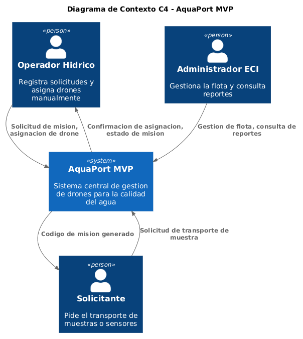
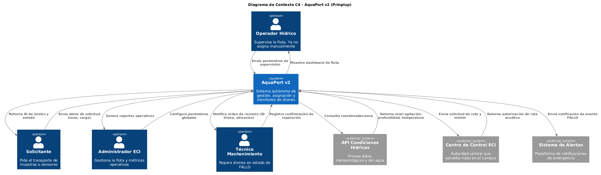

# Evolución de Arquitectura C4: AquaPort MVP vs v2

A continuación se presenta la comparativa arquitectónica a nivel de Contexto (Nivel 1 de C4) entre el MVP inicial y la actual versión 2 (Prinplup).

## AquaPort MVP (v1.0)
El MVP nació como un sistema cerrado y monolítico donde el esfuerzo operativo recaía fuertemente en el **Operador Hídrico**.

## AquaPort v2 (Prinplup)
En la v2, AquaPort evoluciona a un sistema distribuido, proactivo y autónomo. El operador delega la asignación a la IA del sistema, el cual ahora se alimenta del mundo exterior.

## Análisis: ¿Qué creció y qué se mantuvo?

### 1. ¿Qué se mantuvo?
- **El núcleo del negocio:** AquaPort sigue siendo el orquestador principal.
- **Actores fundacionales:** El `Solicitante` sigue pidiendo misiones de la misma forma, el `Operador Hídrico` sigue siendo el usuario principal (aunque su rol evolucionó de ejecutor a supervisor) y el `Administrador ECI` sigue analizando métricas.
- **Flujos base:** El solicitante recibe su confirmación de estado; el Administrador recibe reportes.

### 2. ¿Qué creció? (Nuevos Vectores)
- **Automatización de Decisiones (API Condiciones Hídricas):** Antes, el operador decidía empíricamente si el agua estaba apta. Ahora, AquaPort consulta automáticamente a una API externa pidiendo nivel de agitación, profundidad y temperatura antes de instanciar o asignar el tipo correcto de drone mediante el Factory Method.
- **Burocracia Sistémica (Centro de Control ECI):** AquaPort ya no manda drones a ciegas. Ahora tramita la autorización de ruta con el Centro de Control de la universidad en tiempo real, garantizando la seguridad en el campus.
- **Gestión de Desastres (Técnico y Sistema de Alertas):** Gracias a la implementación del Patrón *Observer*, AquaPort notifica de manera asíncrona a un **Sistema de Alertas** externo y despliega órdenes a un nuevo actor: el **Técnico de Mantenimiento**. Esto cierra el ciclo de vida de los incidentes que antes dependían de llamadas manuales del operador.
